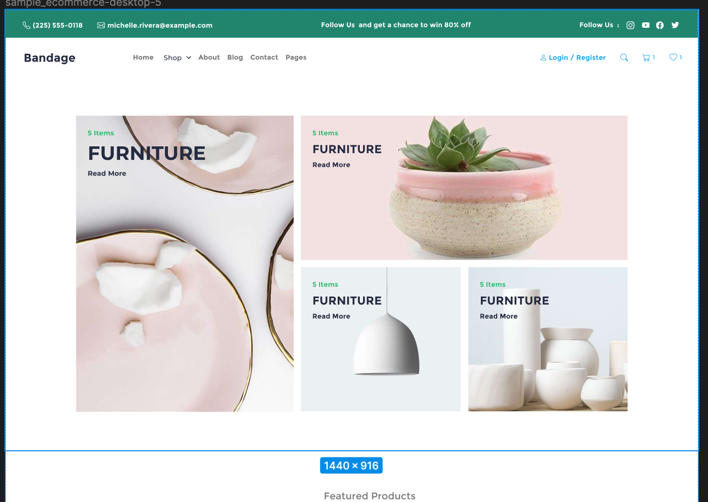

# Bandage E-Commerce Store


Introducing a user-friendly e-commerce website with a minimalist design. Our platform features two main pages: the Homepage and the Product Details page. The Homepage showcases a dynamic product list, sourced from an API, alongside static content. The Product Details page offers comprehensive information about each product. Users can add items to their cart or wishlist, with data persisting even after refreshing or reopening the page. Our website also includes convenient popups for the cart and wishlist. We prioritize accuracy, code discipline, and cleanliness, striving for high-quality implementation and excellent Lighthouse scores.




## LightHouse Score


[LIGHTHOUSE SCORE LINK](https://htmlpreview.github.io/?https://github.com/todak2000/bandage-ecommerce/blob/main/lighthouse_results/desktop/github_com_todak2000_bandage_ecommerce_git.html)


## URL

https://bandage-ecommerce-rho.vercel.app

## Built with

- ⚡️ Next.js 13
- ⚛️ React 18
- ✨ TypeScript
- 💨 Tailwind CSS 3
- ✨ Redux toolkit
- ✨ React Query
- ✨ React-Share
- ✨ localForage
- 🃏 Jest — Configured for unit testing

## Features

This project implements the following features:

- 💎 Homepage: The dynamic content on the Homepage is the products list section, which comes from an API. The rest of the contents are static.
- 💎 Product Details Page: This page has dynamic content related to product details and a static ‘best seller’ section.
- 💎 Pagination: The product list on the Homepage supports pagination without refreshing the page. This was managed using react-query library for seamless fetching of data with optimum efficiency. See `src/utils/hooks.ts` for details.
- 💎 Cart and Wishlist: Users can add products to their cart or wishlist from the Product Details page.
- 💎 Popups: The website features popups for the cart and wishlist, displaying the user’s selected items.
- 💎 Data Persistence: The data in the cart and wishlist persist even after refreshing or reopening the page. This feature was managed using IndexDB as provided on browsers via the localForage library. See `src/utils/persistentStorage.ts` for details.

## Getting Started

To run this project locally, you will need to have Node.js, preferably version 20,  npm, and TypeScript installed on your machine. 

## Installation

Clone this repository to your local machine:

```
git clone https://github.com/todak2000/bandage-ecommerce.git

```

Navigate to the project directory and install the dependencies:

```
cd bandage-ecommerce
yarn install
```

## Development

Jest was used to implement unit Tests. see `__tests__`  to  run full test on all components. Run the following command:

```
yarn test
```

For specific components. Run the following command:

```
yarn test __tests__/unit/<TESTFILE>
```

e.g.`yarn test __tests__/unit/NavBar.test.tsx` where `<TESTFILE>` = `NavBar.test.tsx`.

## Development

To start the development server, run the following command:

```
yarn dev
```

The website will be available at http://localhost:3000.

## API Functions documentation

Refer to the API documentation

`src/app/api/README.md` - [CLICK HERE](src/app/api/README.md)

## Deployment

This app was deployed to vercel

## License

This project is licensed under the MIT License - see the LICENSE file for details.

## Author

Made with ♥ by [Daniel Olagunju](https://github.com/todak2000) [](https://twitter.com/todak)

---


